# Trading Ký — App Flow Diagram

## 1. Tổng quan Navigation (Mermaid)

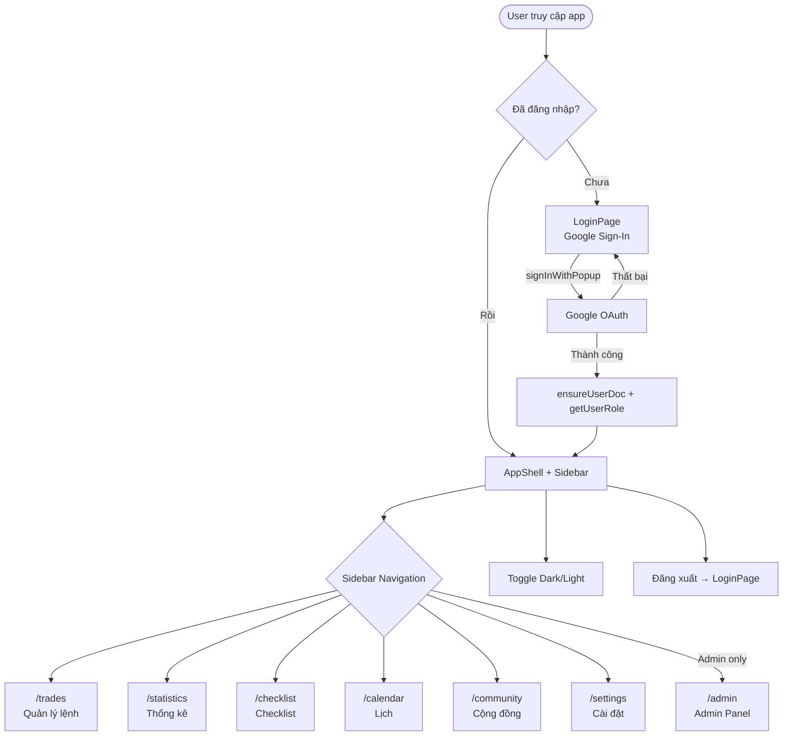

---

## 2. Flow Trades Page — CRUD chính

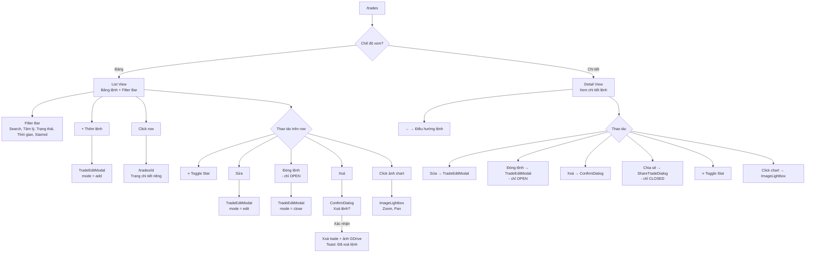

---

## 3. Flow Tạo / Sửa / Đóng lệnh (TradeEditModal)

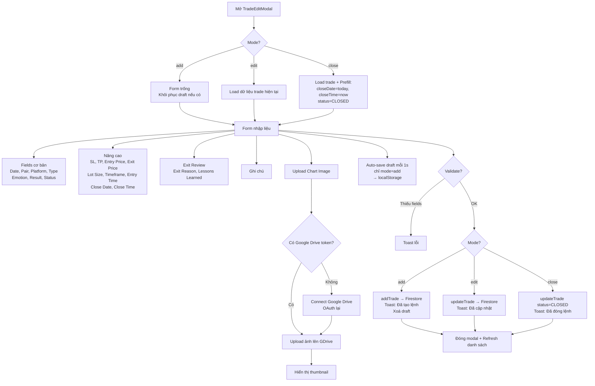

---

## 4. Flow Chia sẻ lệnh (ShareTradeDialog)

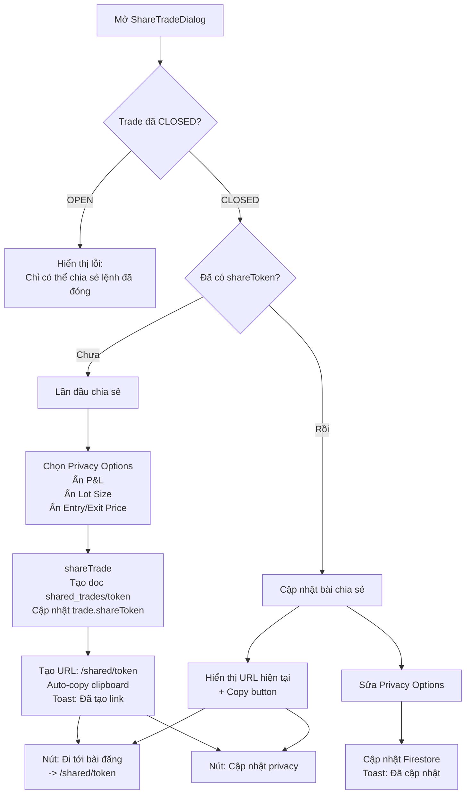

---

## 5. Flow Community

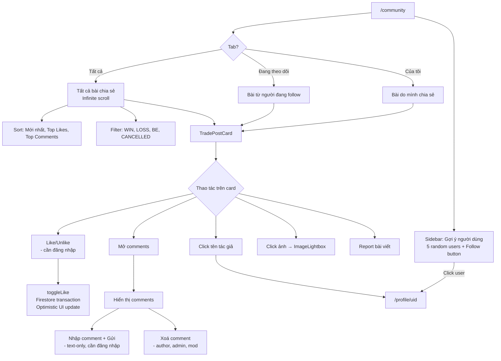

---

## 6. Flow Profile & Follow

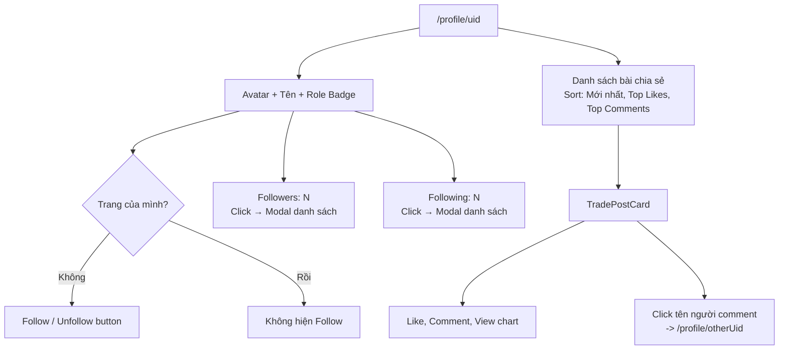

---

## 7. Flow Shared Trade (Public)

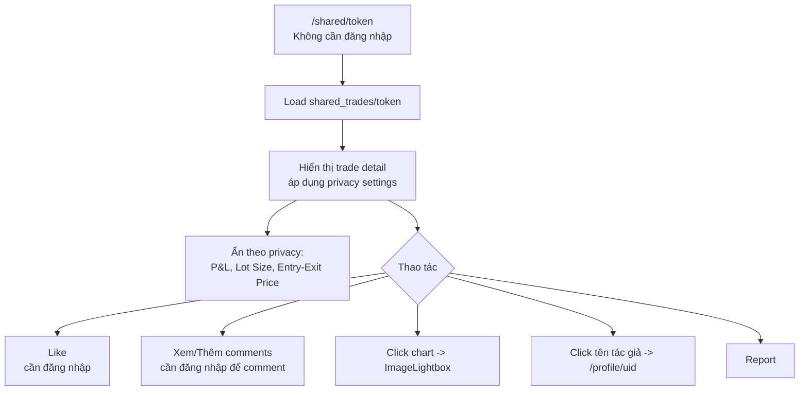

---

## 8. Flow Calendar

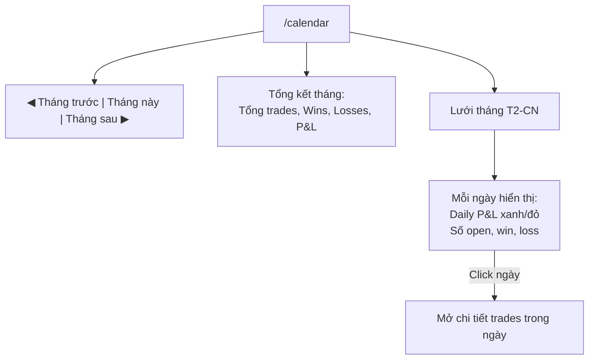

---

## 9. Flow Statistics

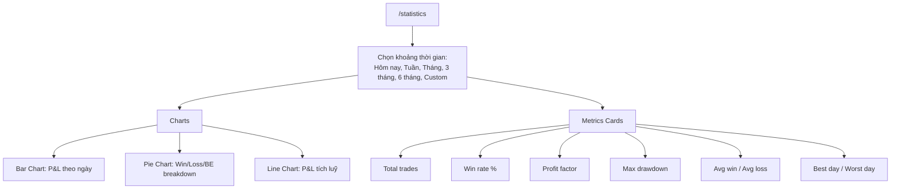

---

## 10. Flow Settings

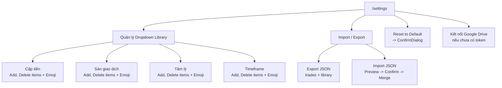

---

## 11. Flow Admin Panel

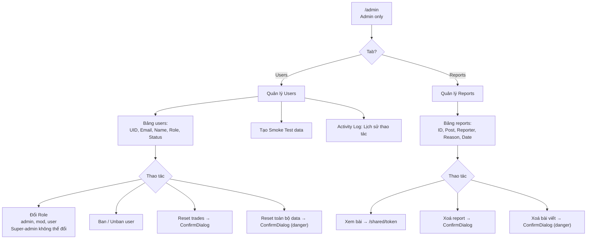

---

## 12. Flow Checklist

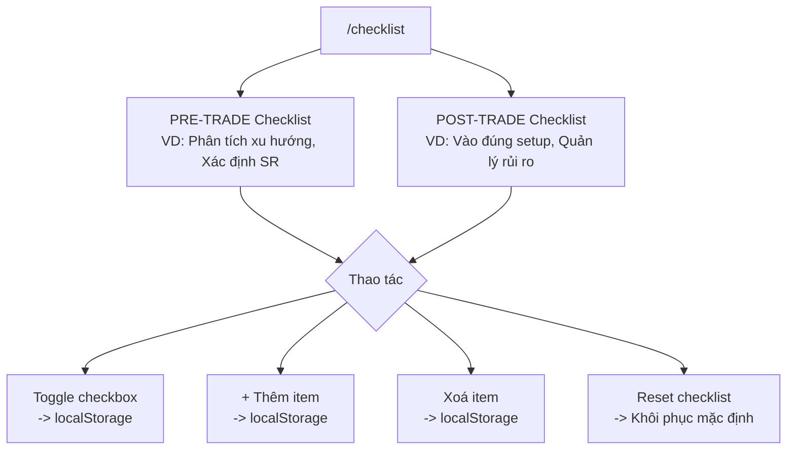

---

## 13. Tổng quan Auth & Role-Based Access

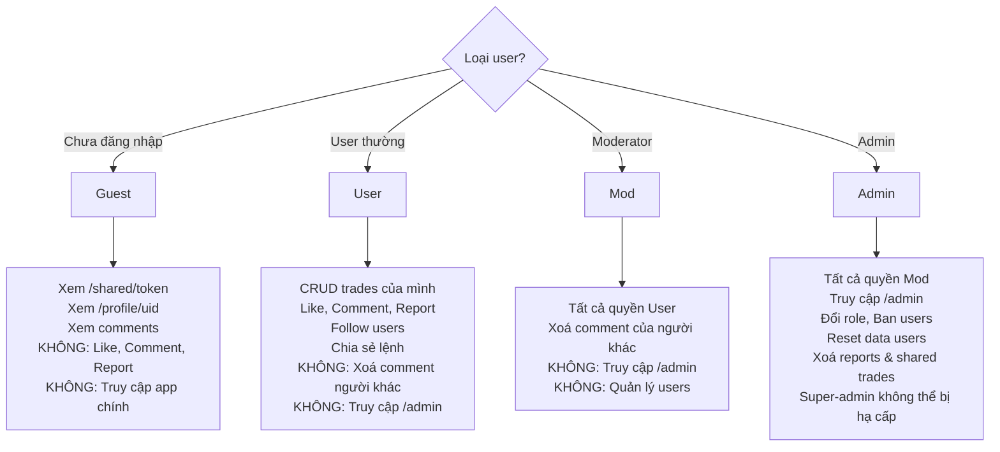

---

## 14. Data Flow Overview

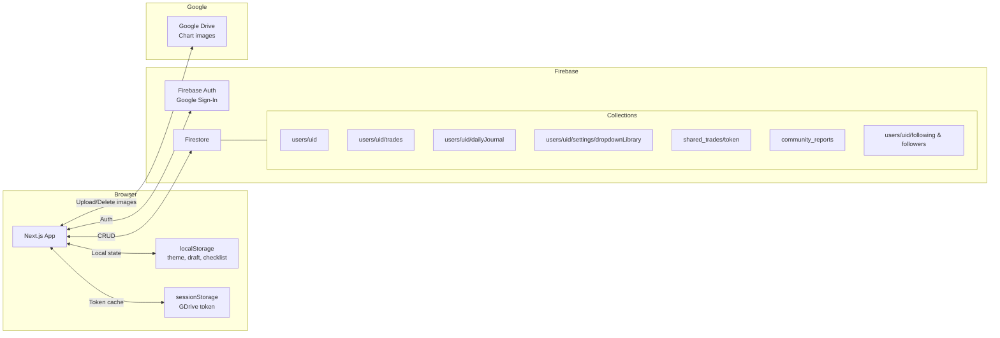
